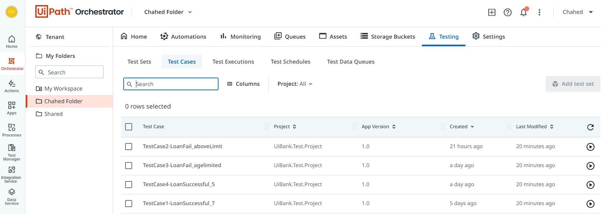

# UiBank_Test_Project

## Technology:
- Uipath test manager 
- Uipath Studio test case

## Purpose:
- Creating test cases for  uiBank page: https://uibank.uipath.com/
- Saving test cases in Test Manager and automate the Project to run the tests each time it is needed
- Creating Tests Set 
- Measuring performance ( time , installation ..etc)

## Succesfully able to add te cases in cloud and automating them using unattended robot 
